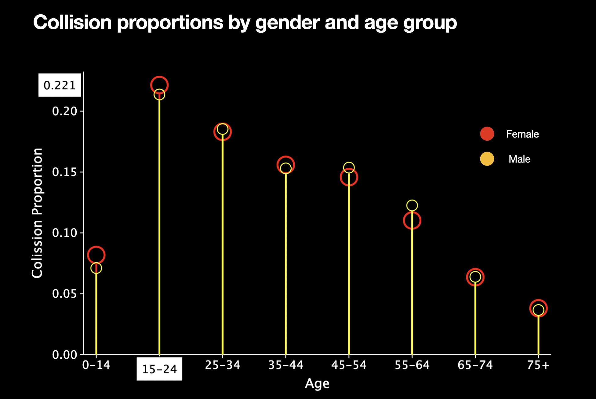

# Canadian National Collision Database (2017) Analysis

---

This repo contains my work on identifying data issues in the 2017 Canadian Collisions dataset, my recommendations for improving data quality, and my analysis of contributing factors to collisions. Where relevant, additional statistical tests are provided to support the findings.

## Introduction

The Canadian National Collision Database (NCDB) contains all police-reported motor vehicle collisions on public roads in Canada that result in death or injury and includes all vehicles and persons involved in these collisions. The data is collected by the Traffic Injury Research Foundation (TIRF) and is provided to the public through the [Open Government Portal](https://open.canada.ca/data/en/dataset/1f1c0d0a-1d4c-4b55-8c2c-ec53b08df7d3).

The 2017 dataset and the data dictionary is included in this repository [here](dataset/)

## 1. Data Issues

The approach to identifying data issues is based on the seven dimensions of quality data, including: — 1. **Accuracy** - the degree to which the data values are correct. 2. **Completeness** - the degree to which all expected data records are present. 3.**Validity** - the degree to which the values in a data element are valid. 4. **Uniqueness** - the degree to which the data records are not duplicated. 5. **Timeliness** - the degree to which a dataset is available when expected and depends on service level agreements being set up. 6. **Consistency** - the degree to which a dataset is internally consistent with other datasets. 7. **Relevance** - the degree to which a dataset meets the requirements for the intended use.

The following is a high-level summary of the issues identified in the dataset:
<br>

|   Quality dimension |   Verdict |   Observation |
|--- |--- |--- |
|  Completeness  |   Passed |    No missing values or missed data records.   |
|  Validity  |   Failed |   At least 20 records with seven features (Columns) as ‘Unknown’ are present including month, day, hour, and vehicle — all assigned to the same case number. |
|  Timeliness  |   Passed |    No missing values or missed data records.   |
|  Uniqueness  |   Failed |    Duplicate records present.   |
|  Consistency  |   Passed |    Data format was as expected, is reference-able with the data keys.   |
|  Accuracy  |   Passed |    Without domain knowledge, findings were inconclusive.   |
|  Relevance |   Passed |    Dataset generally meets the requirements for the intended use.   |

### Data issue recommendations

The following recommendations are essential to improve the quality of the dataset or similar datasets:

- Rigorous data profiling and control of incoming data. The data is coming from different jurisdictions and is aggregated for distribution. Therefore, data quality from sources cannot be guaranteed. A good data profiling tool should be able to check the following aspects of the data — format, patterns, consistency on each record, data value distributions, anomalies, and completeness.
- Data pipeline design to avoid duplicate data through a regularly reviewed centralized data management system and consistent quality control checks.
- Accurate gathering of data requirements, including precise requirements documentation and capturing all data conditions and scenarios.
- Integration of data lineage traceability system. Unique keys or unique sequence numbers. Add a timestamp (or version) to each data record to indicate when it is added or changed.
- Capable data quality control system. This system should be able to check the following aspects of the data—format, patterns, consistency on each record, data value distributions, anomalies, and completeness.

## 2. Analysis

Ananalysis of the dataset was performed in Python using the Pandas, Numpy, and ggplot libraries. The code notebook can be found [**here.**](notebooks/) The analysis focused on answering the following questions:\
2.1. What age range and which sex are more likely to be associated with a collision?\
2.2 What time(s) of days are most associated with a relatively high fatality rate?\
2.3 What type(s) of weather are most associated with a relatively high fatality rate?\
2.4 What is the effect of using a Safety device on the fatality rate?\
2.5 Use the previous charts/reports and perform additional ad hoc analysis of the dataset to outline the key contributing factors to Canadian collisions.

### 2.1 What age range and which sex are more likely to be associated with a collision?
Since the dataset and data dictionary didnt have the age group classification structure, I adopted government of Canada structure that can be found [here](https://www23.statcan.gc.ca/imdb/p3VD.pl?Function=getVD&TVD=252430)

```sql
| Code |         Category         |
|------|--------------------------|
|  1   |    15 to 24 years        |
|  2   |    25 - 34 years         |
|  3   |    35 - 44 years         |
|  4   |    45 - 54 years         |
|  5   |    55 - 64 years         |
|  6   |    65 - 74 years         |
|  7   |    75 years and over     |
```
```python
age_ranges = [(0, 14), (15, 24), (25, 34), (35, 44), (45, 54), (55, 64), (65, 74), (75, 100)]
age_range_labels = ['0-14', '15-24', '25-34', '35-44', '45-54', '55-64', '65-74', '75+']

| Index |  Age  |   Female  |   Male    |
|-------|-------|-----------|-----------|
| 0     | 0-14  | 0.081847  | 0.071099  |
| 1     | 15-24 | 0.221457  | 0.213721  |
| 2     | 25-34 | 0.183045  | 0.185339  |
| 3     | 35-44 | 0.155892  | 0.153019  |
| 4     | 45-54 | 0.145812  | 0.153636  |
| 5     | 55-64 | 0.110213  | 0.122564  |
| 6     | 65-74 | 0.063627  | 0.063949  |
| 7     | 75+   | 0.038107  | 0.036673  |

The age range and sex more likely to be associated with a collision:
Age Range: 15-24, Sex: Female
Collision Proportion: 22.15%
```



**Observations**
Generally, there isn't a significant difference in collision proportions between males and females across different age groups. The proportion values between the two genders are relatively close for most age categories. There isn't a solid or consistent pattern indicating a significant difference in collision rates based solely on gender or age.

The age group "15-24" has the most significant difference in collision proportions between males and females, with a slightly higher ratio for females. This suggests that young adult females are more likely to be involved in collisions than their male counterparts.

**Is the test statistically significant?**
```python
contingency_table = collision_counts.values

# Perform the chi-square test
chi2, p, dof, expected = chi2_contingency(contingency_table)

# Determine if the result is statistically significant (using a significance level of 0.05)
alpha = 0.05
is_significant = p < alpha

# Print the chi-square test results
print("Chi-Square Test Results:")
print(f"Chi-Square Value: {chi2:.4f}")
print(f"P-Value: {p:.4f}")
print(f"Degrees of Freedom: {dof}")
print(f"Is the result statistically significant? {'Yes' if is_significant else 'No'}")
```
```yaml
Chi-Square Test Results:
Chi-Square Value: 243.8529
P-Value: 0.0000
Degrees of Freedom: 7
Is the result statistically significant? Yes
```

The result suggests that certain age ranges and sexes are more likely to be associated with collisions compared to what would be expected by random chance. This finding has practical implications for understanding the factors that contribute to collisions and may guide targeted safety measures or interventions based on age and sex demographics

<br>

### 2.2 What time(s) of days are most associated with a relatively high fatality rate?
In analyzing the fatality rate, the subset of records with a fatality of three is divided by all collisions and expressed as a percentage. The following chart shows the fatality rate by time of day.

```python
fatality_df = df[df['P_ISEV'] == 3]
fatality_rate_by_hour = fatality_df.groupby('C_HOUR').size() / df.groupby('C_HOUR').size()
fatality_rate_by_hour.head()

| index | 0       | 1       | 2       | 3       | 4       | 5       | 6       | 7       | 8       | 9       | 10      | 11      | 12      | 13      | 14      | 15      | 16      | 17      | 18      | 19      | 20      | 21      | 22      | 23      |
|-------|---------|---------|---------|---------|---------|---------|---------|---------|---------|---------|---------|---------|---------|---------|---------|---------|---------|---------|---------|---------|---------|---------|---------|---------|
| HOUR  | 0.000000| 1.000000| 2.000000| 3.000000| 4.000000| 5.000000| 6.000000| 7.000000| 8.000000| 9.000000|10.000000|11.000000|12.000000|13.000000|14.000000|15.000000|16.000000|17.000000|18.000000|19.000000|20.000000|21.000000|22.000000|23.000000|
|Fat_Rte| 0.019541| 0.021089| 0.018909| 0.028208| 0.020680| 0.018479| 0.011550| 0.006664| 0.003976| 0.005108| 0.006721| 0.005594| 0.005919| 0.005488| 0.005276| 0.004784| 0.004805| 0.003947| 0.006483| 0.007749| 0.007419| 0.009256| 0.010598| 0.013012|

Time of Day Most Associated with High Fatality Rate:
Hour: 3.0, Fatality Rate: 2.82%

```


**Observations**\

The fatality rate of collisions tends to have higher values during the early morning hours (around 3 am) and late evening hours (around 8 pm to 11 pm). These times show slightly higher fatalities compared to other hours of the day. This suggests that collisions during these periods are more likely to result in fatalities.

The period with the highest fatalities is between 1 am and 4 am, with the peak occurring at 3 am (2.82%). The lowest rates appear during the daytime between 8 am (0.4%) and 5 pm (0.39%), followed by a five-fold increase between 5 pm and midnight.

### 2.3 What type(s) of weather are most associated with a relatively high fatality rate?
In analyzing the fatality rate by weather type, the subset of records with a fatality (3) divided by all collisions aggregated by weather type and expressed as a percentage. The following chart shows the fatality rate by weather type.

```python
fatality_df = df[df['P_ISEV'] == 3]
fatality_rate_by_weather = fatality_df.groupby('C_WTHR').size() / df.groupby('C_WTHR').size()

|  C_WTHR  |  Dry      |  Wet      |  Snow     |  Slush    |  Icy      |  Sand/gravel |  Muddy    |  other    |  Unknown  |
|---------:|----------:|----------:|----------:|----------:|----------:|-------------:|----------:|----------:|----------:|
| fat_rte  |  0.006321 |  0.006669 |  0.005563 |  0.006545 |  0.004231 |    0.011474 |  0.004020 |  0.010417 |  0.011333 |


Weather Type Most Associated with High Fatality Rate:
Weather: Sand/gravel, Fatality Rate: 1.15%
```


**Observations**\

The fatality rates of collisions vary across different weather conditions. The highest fatality rate is associated with "Sand/gravel," followed by "Unknown" and "other" weather conditions. "Icy" and "Muddy" conditions have relatively lower fatality rates than others.

Overall, adverse weather conditions, such as "Sand/gravel," "Unknown," and "other," pose a higher risk of fatal collisions. Conversely, weather conditions like "Dry," "Wet," "Snow," and "slush" have moderate fatality rates. Considering these trends when evaluating road safety measures and strategies is essential.

### 2.4 What is the effect of using a Safety device on the fatality rate?
In analyzing the fatality rate by a safety device, the subset of records with a fatality (3) divided by all collisions aggregated by the safety device. The following chart shows the fatality rate by safety device.

```python
fatality_df = df[df['P_ISEV'] == 3]
fatality_rate_by_safety = fatality_df.groupby('P_SAFE').size() / df.groupby('P_SAFE').size()
fatality_rate_by_safety

|  i| P_SAFE                        |  fat_rte |
|---|-------------------------------|---------:|
|  0| No safety device              | 0.047818 |
|  1| Safety device used            | 0.003761 |
|  2| Helmet                        | 0.027932 |
|  3| Reflective clothing           | 0.126582 |
|  4| Other safety device           | 0.005171 |
|  5| No safety device used — buses | 0.007900 |
|  6| Not applicable                | 0.005010 |
|  7| Other                         | 0.014073 |
|  8| Unknown                       | 0.009238 |

Safety Device Most Associated with High Fatality Rate:
Safety Device: 'Reflective clothing', Fatality Rate: 12.66%
```


**Observations**\

It can be inferred that overall physical protective safety devices like helmets tend to reduce fatality in a collision. In contrast, preventive safety devices like reflective clothing may not have the same impact in reducing fatality rates in the event of a crash.

Collisions where safety devices were used, have the lowest fatality rate, indicating that the use of safety devices is associated with a lower risk of fatal outcomes.

Collisions involving individuals wearing reflective clothing have the highest fatality rate. Reflective clothing enhances visibility and might not provide physical protection during a collision. 

**Is the test statistically significant?**
```python
contingency_table = pd.crosstab(df['P_SAFE'], df['P_ISEV'] == 3)

# Conduct the chi-square test
chi2, p, dof, expected = chi2_contingency(contingency_table)

# Interpret the results
print("Chi-Square Test Results:")
print(f"Chi-Square Value: {chi2:.4f}")
print(f"P-Value: {p:.4f}")
print(f"Degrees of Freedom: {dof}")
print("Is the result statistically significant? " + ("Yes" if p < 0.05 else "No"))
```
```yaml
Chi-Square Test Results:
- Chi-Square Value: 2956.0980
- P-Value: 0.0000
- Degrees of Freedom: 8
- Is the result statistically significant? Yes
```
The statistically significant p-value indicates that there is a strong association between the use of a safety device and the fatality rate. The data provides evidence that the use of safety devices is not independent of the fatality rate in collisions.


### 2.5 Use the previous charts/reports and perform additional ad hoc analysis of the dataset to outline the key contributing factors to Canadian collisions.

>> #### 2.5.1 Road Alignment & Collision Configuration
I investigated road alignment and collision configuration to determine if there is a relationship between these factors and the number of collisions. The following chart shows the collision configuration by road alignment.

```python
# Prepare the dataset
df1 = df.loc[:,['C_RALN','C_CONF']]
df1.C_RALN = df1.C_RALN.replace({'Q':7,'U':8}).astype(int)
df1.C_CONF = df1.C_CONF.replace({'QQ':42,'UU':43,'XX':43}).astype(int)

# Separate different collision config.
df6 = []
df6.append( df1[df1.C_CONF < 10] )
df6.append( df1[(df1.C_CONF > 20)&(df1.C_CONF < 30)] )
df6.append( df1[(df1.C_CONF > 30)&(df1.C_CONF < 40)] )
df6.append( df1[df1.C_CONF > 40] )

# Summarize the collision numbers
se6 = []; df7 = []
for i in range(0,4):
    se6.append( df6[i].groupby(['C_RALN','C_CONF']).size() )
    se6[i].name = 'collision'
    df7.append( pd.DataFrame(se6[i]).reset_index() )

# plot using ggplot
```


**Observations**\

Most collision for one car accident is hitting a stationary object, followed closely by right and left roll onto the shoulder.

For two vehicles moving in the same direction, most accidents are rear-end collisions, which increase along road alignment.

For two vehicles traveling in opposite directions, a right-angle collision is the largest; this is probably happening at intersections. Left-turn conflict poses a considerable risk, but right-turn is minimal, lower than head-on collisions.

Most collisions happen on a level and aligned road. Drivers must pay close attention when driving in good road conditions, following traffic rules and regulations, and avoiding distractions.
<br>
<br>

>> #### 2.5.2 The effect of veichle type and collision configuration on fatality rate

I investigated the effect of vehicle type and collision configuration on the fatality rate. The following chart shows the fatality rate by vehicle type and collision configuration.

```python
# Filter relevant columns
relevant_columns = ['V_TYPE', 'C_CONF', 'C_SEV']
filtered_df = df[relevant_columns]

# Group by 'V_TYPE' and 'C_CONF' and calculate relevant metrics
grouped_df = filtered_df.groupby(['V_TYPE', 'C_CONF']).agg(
    Total=('V_TYPE', 'count'),
    Fatalities=('C_SEV', lambda x: (x == 1).sum())
).reset_index()

# Calculate fatality rates within each group
grouped_df['Fatality Rate'] = (grouped_df['Fatalities'] / grouped_df['Total']) * 100

# Convert numeric columns to strings for concatenation
grouped_df['V_TYPE_C_CONF'] = grouped_df['V_TYPE'].astype(str) + ' - ' + grouped_df['C_CONF'].astype(str)

grouped_df.head(10)
------------------------------------------------------------------------
| V_TYPE | C_CONF | Total | Fatalities | Fatality Rate | V_TYPE_C_CONF |
|--------|--------|-------|------------|---------------|---------------|
|   1    |   2    |  6073 |    102     |   1.679565    |     1 - 2     |
|   1    |   6    | 16607 |    379     |   2.282170    |     1 - 6     |
|   1    |   21   | 72399 |    281     |   0.388127    |    1 - 21     |
|   1    |   33   | 15802 |    112     |   0.708771    |    1 - 33     |
|   1    |   35   | 31841 |    329     |   1.033259    |    1 - 35     |
|   1    |   36   | 22211 |     94     |   0.423214    |    1 - 36     |
|   5    |   2    |    21 |      0     |   0.000000    |     5 - 2     |
|   5    |   6    |   119 |      6     |   5.042017    |     5 - 6     |
|   5    |   21   |   936 |      4     |   0.427350    |    5 - 21     |
|   5    |   33   |   278 |      2     |   0.719424    |    5 - 33     |

# plot the data using ggplot
```


**Observations**\

**High fatality:** Certain combinations of vehicle types and collision configurations exhibit notably higher fatality rates. For instance, combinations like snowmobiles involved in a collision while in a left turn across opposing traffic (22-33) result in 60% fatality, and snowmobiles involved in a crash with any other two-vehicle (22-36) result in 50% fatality.

**Low fatality:** There is a diversity of fatality rates across different vehicle types and collision configurations. Smaller school buses (10), purpose-built motorhomes (18), and fire engines (21) have zero fatality. This indicates that these vehicles are generally safer. 

The fatality rates vary significantly between vehicle types and collision configurations. The trends observed may suggest potential factors contributing to higher or lower fatality rates, but further analysis and domain knowledge would be needed to draw more definitive conclusions.
